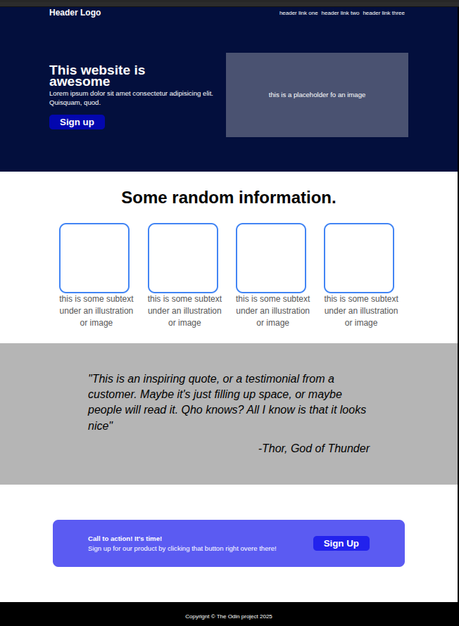

# Odin Landing Page

A simple landing page built for [The Odin Project] Foundations course.  
The project practices **HTML** and **CSS (Flexbox)** to create a clean layout.

## Features
- Header with logo and navigation
- Hero section with call-to-action
- Info section with image placeholders
- Quote/testimonial section
- Call-to-action banner + footer

## Getting Started
Open `index.html` in your browser to view the page.

